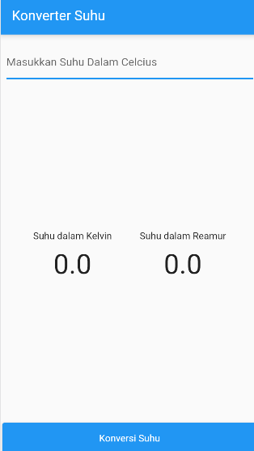
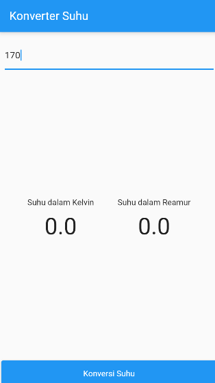
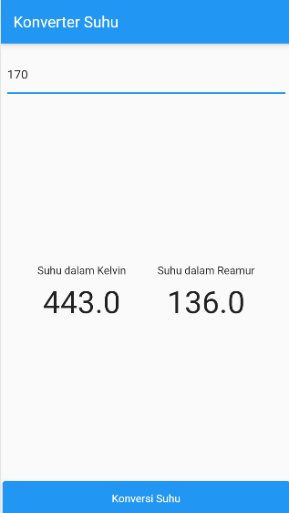
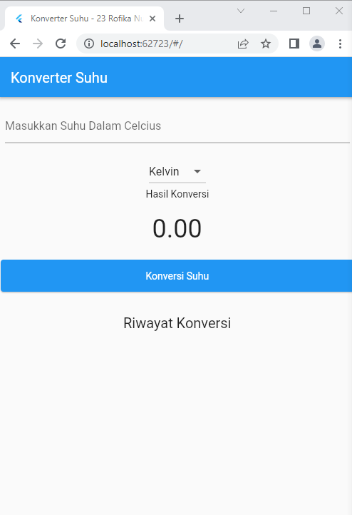
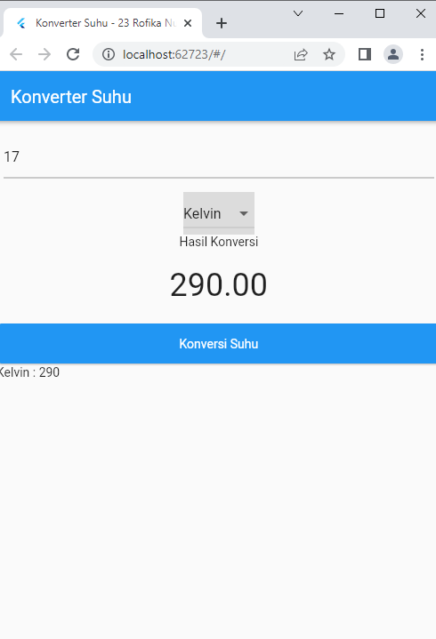
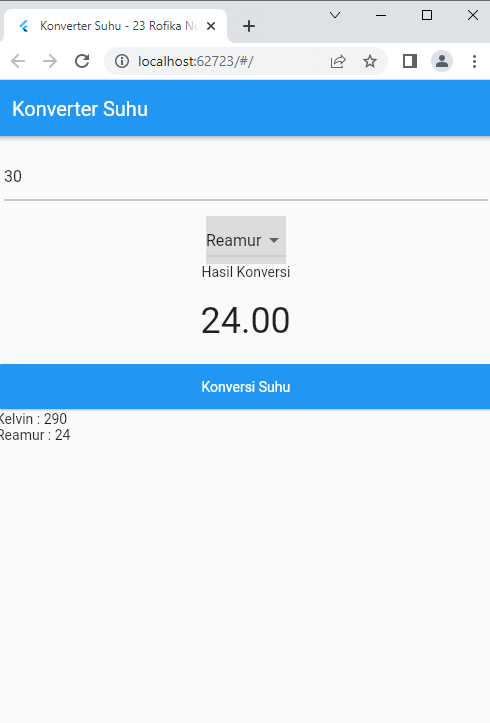

# konversi_suhu_flutter

<li>Rofika Nur 'Aini</li>
<li>TI - 3B</li>
<li>2041720099</li>

## Application with Statefull Widget - Konverter Suhu

Hasil Praktikum:

### JOBSHEET 4. STATEFULL WIDGET DAN MAP 

Hasil Praktikum:

